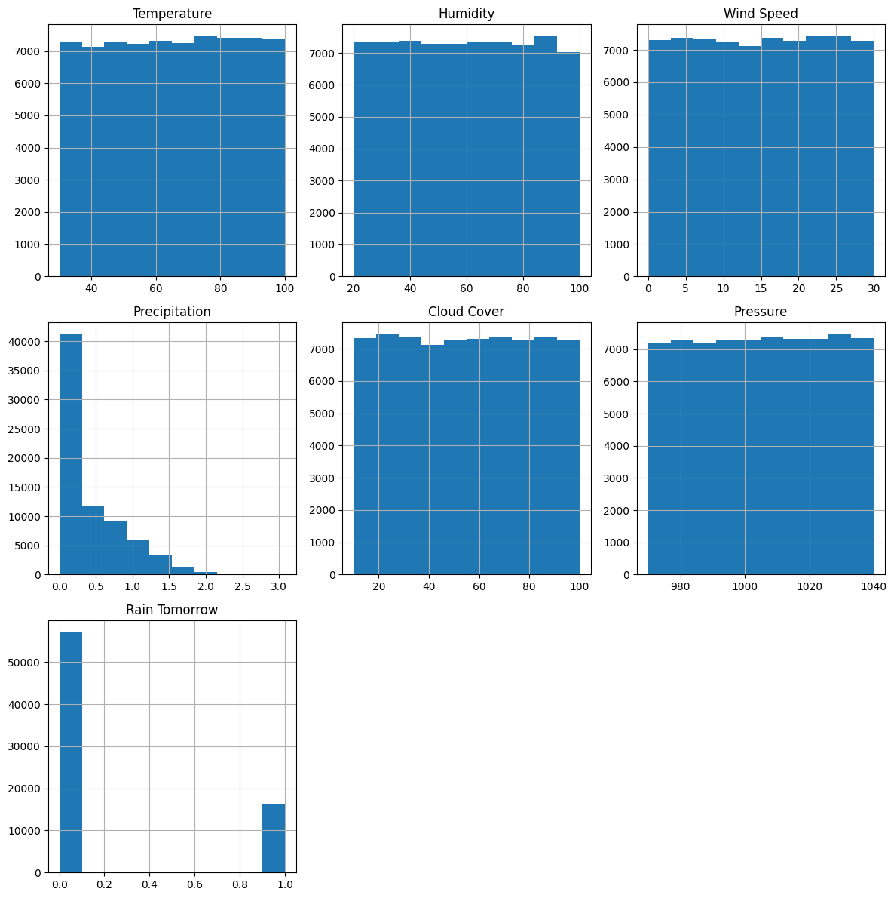

# StormCast: LSTM Weather Forecasting

StormCast is an end-to-end machine learning project for short-term storm and rainfall forecasting.

This repo predicts:
1. Will it rain tomorrow? (binary classification)
2. How much precipitation is expected? (regression in mm)

## Why This Matters

Most weather datasets have noisy, nonlinear temporal patterns. This project uses sequence models (LSTM) and a leakage-safe pipeline to produce practical forecasts that can support warning and preparedness workflows.

## Results Snapshot (Current Model Artifacts)

Metrics below come from the current trained models in `models/` and match the evaluation workflow used in the notebooks and scripts.

### Regression (Precipitation)
1. MAE: 0.3744 mm
2. MSE: 0.2078
3. RMSE: 0.4559 mm
4. R^2: -0.0029

### Classification (Rain / No Rain)
1. Accuracy: 38.44%
2. Rain precision: 0.18
3. Rain recall: 0.60
4. Rain F1: 0.28
5. Macro F1: 0.37

## Visual Output



## Team and Ownership

| Team Member | Role | Portfolio-Ready Ownership |
| --- | --- | --- |
| Alvaro (Manny) Gonzalez | Data Prep and ML Engineering | Data prep notebooks in `data_prep/`, leakage-safe pipeline in `src/pipeline_utils.py`, train/eval scripts, API monitoring, tests, and CI workflow |
| Eric Gerner | Modeling and Tuning | LSTM architecture iteration, training strategy, and model improvement experiments |
| Ben Johnson-Gomez | Evaluation and Reporting | Evaluation interpretation, reporting, presentation artifacts, and narrative framing |

Note: Contributor history in this repo currently shows most commits under Alvaro and RaspyPiano24270 aliases, so this table is a clearer role map for external reviewers.

## Environment Setup (Working)

```bash
py -m venv .venv
.venv\Scripts\activate
py -m pip install --upgrade pip
py -m pip install -r requirements.txt
```

## Run the Project

### 1. Train models

```bash
py -m src.train_classifier
py -m src.train_regressor
```

### 2. Evaluate models

```bash
py -m src.evaluate_classifier --no-mlflow
py -m src.evaluate_regressor --no-mlflow
```

### 3. Run baseline walk-forward benchmarks

```bash
py -m src.evaluate_baselines --n-splits 5
```

### 4. Start API

```bash
uvicorn src.api_server:app --reload
```

Key API endpoints:
1. `GET /health`
2. `GET /metadata`
3. `POST /predict/all`
4. `GET /metrics`

### 5. Run tests

```bash
pytest -q
```

## Notebook Structure

All notebooks are now in `data_prep/` with an author docstring at the top for clear ownership attribution:
1. `data_prep/EDA.ipynb`
2. `data_prep/Training.ipynb`
3. `data_prep/Model_Playground.ipynb`
4. `data_prep/Final_Presentation.ipynb`

## Streamlit Demo (Aspirational Upgrade Implemented)

A lightweight Streamlit app is included so reviewers can input weather values and get prediction outputs.

Run locally:

```bash
streamlit run streamlit_app.py
```

Default app flow:
1. Connect to API (`http://127.0.0.1:8000`)
2. Auto-load feature columns from metadata
3. Enter sample weather values
4. Get rain probability, predicted precipitation, and a severity label

## Hugging Face Spaces Deployment Path

To publish a live demo:
1. Create a new Hugging Face Space (Streamlit SDK)
2. Upload this repository
3. Set app file to `streamlit_app.py`
4. Ensure `requirements.txt` is used for install
5. Optionally set API URL to your hosted backend

## Project Layout

1. `src/`: training, evaluation, API, CLI, utilities
2. `data_prep/`: EDA and modeling notebooks with ownership docstrings
3. `frontend/`: static browser dashboard
4. `tests/`: API, pipeline, and baseline smoke tests
5. `.github/workflows/ci.yml`: automated CI checks